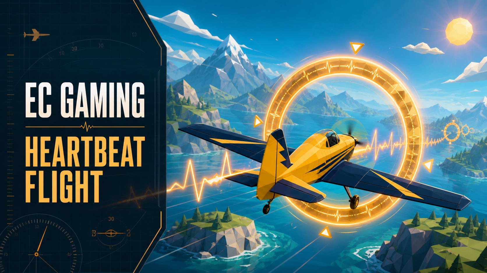

# EC Gaming

**EC Gaming turns live ECG-derived signals into browser games.** The first game, Heartbeat Flight, is an original low-poly airplane experience that runs as a normal 3D web app and can enter immersive WebXR on a compatible headset.

[Play Heartbeat Flight](https://georgefejer91.github.io/ECGaming/) · [Protocol](docs/PROTOCOL.md) · [Hardware validation](docs/HARDWARE-VALIDATION.md)



## How it works

There are two play paths and three deliberately scoped browser roles:

1. **Smartphone Flight** combines Polar acquisition and the game in one tab. A compatible Android browser connects directly to a worn Polar H10 over Web Bluetooth; raw ECG and derived controls stay on that phone.
2. **Ground Control** runs in desktop Chrome or Edge. It connects to a worn Polar H10 over Web Bluetooth, derives metrics locally, maps them to game commands, and broadcasts normalized controls.
3. **Flight Deck** runs in a normal browser, iPhone/iPad, or Meta Quest Browser. It receives only game commands through a data-only VDO.Ninja/WebRTC bridge. It never requests Bluetooth, camera, or microphone access.

```text
Direct phone:  Polar H10 ──Bluetooth──▶ Smartphone Flight
                                         derive + play locally

Network:       Polar H10 ──Bluetooth──▶ Ground Control ──WebRTC data──▶ Flight Deck
                ECG 130 Hz + HR/RR       derive + map locally           flat 3D / WebXR
```

Direct phone pairing is feature-detected, requires HTTPS, and must begin with the **Connect Polar H10** tap. Chrome for Android and compatible Chromium-based Android browsers are the supported path. Safari/WebKit does not expose native Web Bluetooth, so iPhone and iPad use Flight Deck with Ground Control running on another supported device. The deterministic simulator remains available on every browser and is always labelled simulated.

The fixed discovery room is `ecgaming_flight_v1`. It is **public and unauthenticated**. Anonymous random source IDs help identify a session, but they are not access control. Do not transmit sensitive data or use a source you do not recognize.

## Controls and signal mapping

Ground Control exposes one-open-at-a-time aviation panels for the Polar link, flight commands, broadcast tower, and simulator. Smartphone Flight exposes the core choices in a touch-friendly side drawer. Each continuous command can use a derived metric or a manual value, with input range, reversal, and attack/release smoothing.

| Command   | Default                         | Game range                  |
| --------- | ------------------------------- | --------------------------- |
| Altitude  | Excite-O-Meter excitement score | `-1…1`                      |
| Throttle  | Manual `0.5`                    | 8–14 world units/second     |
| Traffic   | Manual `0.5`                    | one ring every 10–3 seconds |
| Heartbeat | Experimental ECG R-peak         | visual and engine pulse     |

The optional **heartbeat lift** action replaces the continuous altitude target; the two vertical-control modes are mutually exclusive. Horizontal steering remains local: A/D, arrow keys, touch drag, or a Quest thumbstick.

Polar Heart Rate Service RR notifications are available as an alternate beat source. They can contain multiple intervals in one notification, so they are useful interval data but not guaranteed exact beat-arrival timing. The ECG R-peak path reconstructs the 130 Hz sample timestamps and applies a causal adaptive detector with a 250 ms refractory period and RR cross-check. It is experimental and not a medical detector.

## Game rules

- Fly through a ring: **+1 point**.
- Miss a ring: **lose one life**.
- Three lives; restart after game over.
- If command data is absent for two seconds, play pauses instead of silently falling back to manual altitude.
- Three consecutive fresh frames repair the link, followed by a visible three-second countdown.
- Heartbeat events older than 250 ms are never replayed as late or stacked actions.

## Run locally

Requirements: Node.js 22 or newer and a Chromium browser. Web Bluetooth needs HTTPS or localhost.

```bash
npm install
npm run dev
```

Then open the printed `/ECGaming/` URL. Use Smartphone Flight for one-device play, or use two tabs/devices with Ground Control first and Flight Deck second.

```bash
npm test          # codecs, mapping, detector, transport, rules, privacy
npm run test:browser
npm run build
```

Use `?remote-force-turn=1` on both pages to request a TURN-relayed WebRTC path for qualification.

## Data and privacy

- Raw ECG samples stay inside Ground Control and are used only for the rolling preview and detector.
- In Smartphone Flight, raw ECG likewise stays in the current phone tab and is never sent to a relay room.
- The 32-byte realtime frame contains normalized altitude, throttle, traffic, beat counter/age, quality, and readiness flags.
- A versioned configuration snapshot is sent separately on a reliable ordered data channel.
- Session CSV logging is off by default, bounded in memory, and exported only by an explicit local download.
- Ground Control CSV contains derived metrics, bindings, commands, and beat events—not raw ECG.
- There is no backend, account, cloud upload, camera stream, microphone stream, or analytics service.

See [the wire protocol](docs/PROTOCOL.md) for the exact contract.

## Project structure

```text
ground-control/        Polar connection, mapping, broadcast UI
flight/                flat/WebXR receiver and game UI
mobile/                direct Polar + touch flight UI for phones
src/mobile.ts           local signal-to-game orchestration (no VDO.Ninja)
src/signals/           mappings and experimental R-peak detector
src/protocol/          versioned frames and VDO.Ninja transport
src/game/              reusable game module and Heartbeat Flight
src/logging/           opt-in bounded derived CSV
src/vendor/            BSD Affect Tracker signal code
public/vendor/         MPL VDO.Ninja SDK and its notices
```

`EcgGameModule` is the small game boundary intended for future ECG games, including a heartbeat-synchronized runner. Heartbeat Flight is v1; the runner is not included yet.

## Status and scientific disclaimer

The software implementation and deterministic tests are complete. Physical Polar/Quest qualification requires the explicit gates in [docs/HARDWARE-VALIDATION.md](docs/HARDWARE-VALIDATION.md); this repository does not claim those hardware gates have passed until evidence is recorded there.

EC Gaming is for games, education, and research prototyping. It is **not a medical device**, does not diagnose or treat any condition, and must not be used for safety-critical control.

## License and provenance

EC Gaming is released under the [BSD 3-Clause License](LICENSE). The airplane, rings, terrain, clouds, town, audio, and game logic are original procedural work; no Unity Asset Store/Synty assets or old unlicensed Unity game code are redistributed.

The Polar browser signal layer is reused from Affect Tracker under BSD-3-Clause. The vendored VDO.Ninja SDK remains MPL-2.0. Three.js is MIT. Self-hosted Inter and Barlow Condensed fonts are OFL-1.1. Full notices are in [THIRD_PARTY_NOTICES.md](THIRD_PARTY_NOTICES.md).
