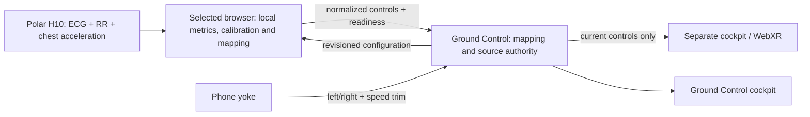

# Phone yoke and private flight session

## Connect and fly

1. On **Ground Control**, click the dedicated SVG **Phone steering** widget.
2. Scan the QR to start pairing, enter your pilot name, and tap the arrow to take control with tilt enabled. Hold the phone/tablet sideways with the screen facing you; its first valid reading sets the centre. A hand symbol appears when motion permission needs a tap on the instrument. Tap the instrument again to recenter. Dragging the grips steers in touch fallback when motion is unavailable; arrow keys also steer. Touching a grip during tilt mode does not override the sensor.
3. To use the phone for ECG, tap the heart-rate icon on the yoke and choose **Phone controller** under **Flight settings → ECG source** on Ground Control.
4. For a third screen, click **Pair separate cockpit** and open or scan its link. This opens `/session-cockpit/`, using the same aircraft and WebXR game engine. It connects automatically. Tap **Start flight** once the selected physical H10 signal is ready.
5. Any of these three roles can own the sensor. Ground Control uses its existing Polar connection; the session cockpit has **Polar H10 on this device → Connect Polar H10**. Select the intended source on Ground Control. Disconnect the old Bluetooth connection before transferring the same H10 if it cannot accept another connection.

The tower owns mappings: excitement/excitometer, HR/RR/HRV, local ECG power, breathing, manual axes, adaptive ranges, reversal, smoothing, and heartbeat actions. The selected phone/cockpit applies this configuration to its local Polar Stream metrics and causal R-peak detector. The tower does not map these controls a second time. An unselected source may stay connected but cannot drive flight. The tower can also use its existing beacon as its current signal.

**Reset range** advances the configuration revision to reset adaptive calibration on the selected source and hold its old controls. Learned metric limits stay on that device; the tower shows source calibration status instead of a second local range.

Left/right tilt steers. Tip the top edge away to add speed; pull it toward you to slow down. Forward/back tilt is a temporary ±0.5 throttle trim, clamped to 0…1, which the tower can disable. Physiology owns altitude and launch readiness. The entire viewport is the yoke face, with SVG grips reaching both device edges. After name entry the steering wheel has no visible text: an artificial horizon follows local bank and pitch relative to calibration, a rotation symbol indicates landscape holding, a hand symbol requests the permission tap, and a heart-rate icon changes colour with connection state. Accessible names and status messages remain available to screen readers. The horizon updates directly from sensor events without waiting for a network round trip. Both landscape orientations work. Rotating or returning from the background centres the next valid reading automatically. Brief sensor silence releases steering while retaining calibration, so movement resumes with fresh readings. The horizon never animates from touch or keyboard input. It starts locally before pairing finishes. If initial readings arrive late, tilt automatically takes over once the grips are released. Submitting the name reveals the yoke immediately and requests browser fullscreen where supported; later taps retry fullscreen if needed.

Legacy standalone/mobile **Flight options** supply phone tilt. Create the full ECG-source session from Ground Control and use its **Pair separate cockpit** link. Existing public beacon/pilot workflows remain separate from private source control.

## Ownership and route

The backend of this static application is an in-browser session router (`FlightSessionHub`); it needs no new application server. Each companion gets a distinct private BRSP/1 connection through the existing VDO.Ninja SDK. There is one phone and one separate cockpit per tower. Replacing either requires a fresh pairing. Source-to-cockpit data takes two peer hops through the tower. Keep all session pages open and awake; suspended browsers cannot provide continuous real-time delivery.

Raw ECG, ECG buffers, H10 acceleration samples, HR/RR series, and derived metric values remain in the source browser. Only normalized altitude/throttle/traffic, selected beat timing, quality/readiness flags, and phone steering travel in this session. The router does not record them. ECG wing traces remain local to the raw ECG browser. Private pairing does not enable public broadcasting. The tower does not republish a private remote source as a public beacon.

## Fast pilot entry

Opening a valid QR invitation immediately loads the pinned transport and starts BRSP pairing while the pilot enters a name. Steering remains neutral during entry. **Take control** reveals the full-screen yoke synchronously, invokes motion permission and fullscreen directly in that gesture, and automatically centres the next valid orientation reading. Local gyro rendering does not wait for signaling. No second Connect or gyro-start action is needed in the normal flow.

The optional negotiated `pilot-label` capability adds a canonical display name (at most 32 characters) to the companion's complete intent and the target's returned state. Ground Control renders the accepted name as plain text. This label grants no authority; the QR secret and mutual proof still bind the session. Peers without the capability keep the existing unlabelled packet shape. Names remain in memory for the session and clear on Stop.

The target publishes once per 30 Hz timer tick, without a second elapsed-time gate that can skip rounded timer intervals. Replaceable intents and state remain coalesced; receiver-local 500 ms leases and explicit source selection are unchanged.

## Practice heart

Ground Control has a silver clockwork-heart **Practice** button beside **Connect Polar H10**. Switch it on to generate a deterministic 130 Hz simulated ECG, HR/RR, and gently varying excitement locally, then use **Start flight** without wearing a sensor. The button pulses with each generated beat. Switch it off to remove practice clearance and hold an active flight. Practice never starts automatically on reload. The hidden diagnostic simulator remains preview-only.

Only this explicit local practice selection relaxes the physical-sensor requirement; simulation stays labelled and flagged as simulated. Remote beacons and separate session cockpits retain their existing physical-source launch checks. Phone tilt controls a practice flight running in Ground Control's cockpit. The paired steering wheel receives the practice beat clock, lights its heart icon amber, and requests one 100 ms vibration per fresh beat without a Bluetooth connection. Practice feedback stops when switched off, hidden, disconnected, or stale; missed beats are never replayed. The existing simulation flag remains intact and no raw samples are sent to the phone. Local H10 feedback is suppressed while the selected practice clock is active.

Ground Control stacks the selected metric and a five-second raw ECG scope at equal heights. Changing the selected metric leaves the raw scope visible. The scope displays local H10 samples or the generated practice ECG, with a brief Live/Practice/Paused state. Remote-source raw samples remain on their source device.

## Motion permissions and heartbeat vibration

Brave blocks motion sensors by default. On Android, enable **Settings → Site settings → Motion sensors** for the controller site, then reopen it from a fresh QR code. A tap on the instrument requests permission on browsers exposing `DeviceOrientationEvent.requestPermission()` (including iOS Safari); it cannot override a sensor block in browser settings. Touch fallback remains available while motion is unavailable.

The phone pulses its vibration motor for **100 ms** on locally detected fresh H10 R peaks. During ECG detector warmup or gaps, incoming valid Polar RR notifications provide fallback pulses; BPM never synthesizes a rhythm. Once R peaks are detected, RR pulses are suppressed to avoid double feedback. Historical peaks older than 200 ms within an ECG frame and batched older RR intervals are not replayed. Bluetooth delivery adds latency relative to the physical R peak. This works independently of the tower's altitude source selection, except while selected practice feedback is active. Hiding the page, disconnecting H10, or ending the session cancels vibration. Unsupported vibration APIs fail silently. Motor intensity is determined by the phone; the web API controls duration, not strength. iOS Safari does not expose this vibration API.

## Versioned contract and freshness

`flight.companion` is the sole granted BRSP scope. Capabilities are `latest-intent`, `latest-state`, `state-snapshot`, and optional `pilot-label`. There are no generic commands, arbitrary input events, remote Bluetooth requests, or remote Start actions. State combines tilt profile `ecgaming-tilt-v1` with version-1 relay state.

- Each latest intent is exactly `{tilt, signal, pilotName}` when `pilot-label` is negotiated, otherwise `{tilt, signal}`. Tilt is `{x, y, active}` with finite axes in −1…1 and zero axes when inactive. Signal is null or `{configRevision, sourceEpoch, status, frame}`.
- A frame is exactly `{sequence, beatCounter, altitude, throttle, traffic, beatAgeMs, quality, flags}`. Unknown fields, including raw ECG or arbitrary metrics, are rejected. Axis/quality ranges and integer counters are checked before mutation.
- The tower supplies mappings, configuration revision, selected source epoch, source assignment, latest frame, steering, and speed-trim enablement. Only the selected peer's current revision/epoch can supply ECG controls. Source or mapping changes clear the accepted frame immediately. Duplicate/older frame sequences cannot renew its lease.
- Sensor readings expire at 350 ms. Receiver-local steering and signal leases expire at 500 ms. Full current intent and state are offered at 30 Hz over an unordered, zero-retry lane. Backpressure retains only the newest pending value. Confirmed state remains separate from the local attitude display and never generates sensor intent.
- The source requires fresh ECG and, when mapped, fresh calibrated chest motion. A live network cannot turn old physiological samples into ready controls. The cockpit checks physical-source/readiness flags, rejects simulation clearance, holds on loss, and requires three continuous ready seconds to resume.
- Configurations repeat in current state so lost packets cannot permanently strand a source on old mappings. Revision checks reject old calculations while it catches up. BRSP independently handles authenticated peer binding, epochs, envelope sequencing, and replay rejection.

A paired source's physical flag is a trusted browser claim, not hardware attestation. Existing experimental physiological algorithms and readiness rules are reused; this feature does not establish clinical validity.

## Pairing and platforms

Each activation generates a random room and 192-bit secret. QR pixels are generated locally. The invitation uses only a URL fragment, validated and removed from phone/cockpit history, and is held in memory. QR/link material clears on pairing, stop, or expiry. Unpaired invitations expire after 10 minutes; sessions expire after two hours. Reconnection requires fresh QR material and mutual role-bound HMAC authentication. A second peer cannot replace a bound companion.

The target starts from its pairing button; opening a valid HTTPS invitation automatically activates the phone or cockpit connection. Plain, invalid, and embedded links remain inert. The pinned SDK loads locally only when pairing starts. Motion and H10 permission requests still require their own button tap. No audio/video tracks, camera or microphone are requested. Stop cancels producers, clears input and pairing material, fences callbacks, and then closes signaling asynchronously. Source disconnect/page exit releases H10 ownership; receiver leases also cover disappearance.

HTTPS and a visible controller page are required. Wake Lock is requested where supported. Motion permission is requested directly from the tap. iOS Safari can serve as a tilt controller but cannot connect H10 through Web Bluetooth: choose supported Android Chromium or desktop Chromium as the sensor source. Unsupported browsers explain the limitation while retaining touch/tilt control. The existing Polar hub prevents competing sensor ownership in same-origin tabs.

VDO.Ninja uses Internet signaling (`wss://wss.vdo.ninja`), TURN discovery (`https://turnservers.vdo.ninja/`), and STUN/TURN connectivity. Same Wi-Fi does not mean offline operation. Paths may be direct or relayed; latency is not guaranteed. Localhost preview QR codes cannot be reached from a separate phone: use the hosted HTTPS site.

## Validation boundaries

`npm test` covers retained BRSP authentication/replay/lifecycle/backpressure tests; orientation/invitation/lease tests; source fencing, mapping revisions, packet privacy, local Polar computations, adaptive calibration, breathing readiness and stale ECG.

`e2e/phone-tilt.spec.ts` covers QR activation, browser WebCrypto, synthetic orientation, confirmed steering/throttle, sensor silence, touch release, disconnect and phone layouts. `e2e/flight-session.spec.ts` uses three pages, deterministic transport and a synthetic hardware boundary to check source-local calculations, tower mapping changes, simultaneous steering, normalized-only packets, ECG loss, handoff and unavailable Bluetooth. No fixtures ship in the app.

Real VDO.Ninja SDK qualification is separate from deterministic transport tests. The adapter includes a bounded early-message fix for a first-Hello race observed with real peers; notices and regression tests are in `src/vendor/brsp`.

Physical H10-to-phone operation, Android/iPhone/tablet motion, Bluetooth handoff, radio transitions, screen sleep and headset immersion still require device qualification. Desktop browser and synthetic sensor tests do not establish those results.

### Real transport check · 2026-09-12

The isolated production build was exercised in three Chromium 151.0.7922.34 pages using the pinned, real VDO.Ninja SDK and Internet signaling. A synthetic H10 boundary fed the actual source-local processor on the phone. Ground Control received normalized altitude 0.60, routed it to the running separate cockpit, and confirmed phone steering and release. Both explicit disconnects propagated. Peer statistics showed direct host-to-host paths, zero media transceivers, and 1–6 ms RTT on this machine. No page errors were recorded. This qualifies the browser/transport path with synthetic physiology, not physical H10, mobile hardware, WAN latency, or forced TURN.
